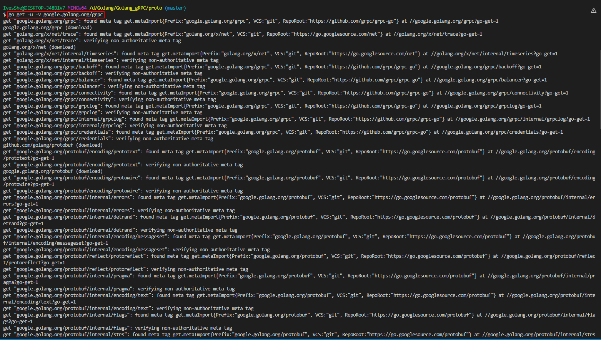
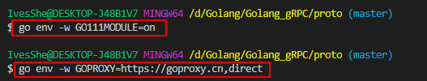
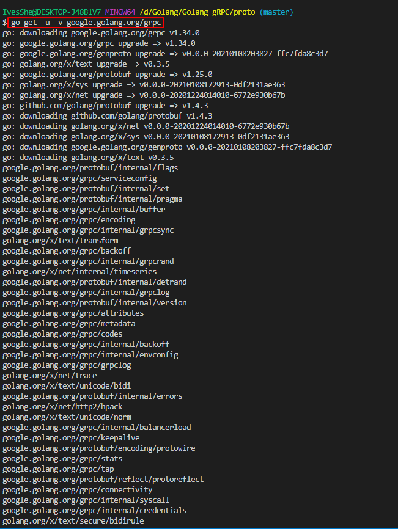
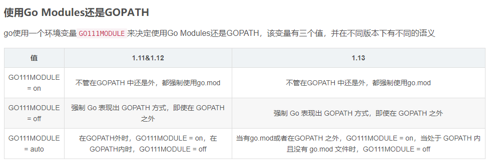
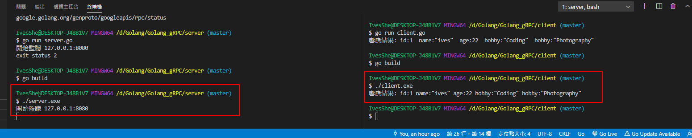
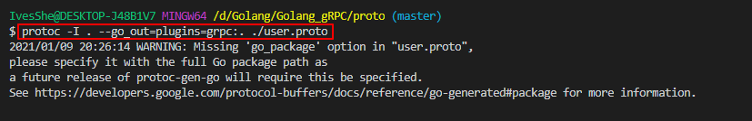

# Golang gRPC

# 下載安裝

```bash
go get -u -v google.golang.org/grpc
go get -u -v github.com/golang/protobuf/protoc-gen-go

go get -u -v google.golang.org/grpc/codes
go get -u -v google.golang.org/grpc/status
go get -u -v google.golang.org/protobuf/reflect/protoreflect
go get -u -v google.golang.org/protobuf/runtime/protoimpl
```



上述如果卡住，可以更換下載的鏡像倉庫後，再重新下載安裝

```bash
go env -w GO111MODULE=on
go env -w GOPROXY=https://goproxy.cn,direct
```



再重新下載




但後來發現這邊設會on會有點問題，所以後來又先設回off，再慢慢等下載了
```bash
go env -w GO111MODULE=off
```



# 執行畫面



# user.proto

```c++
// 版本號
syntax = "proto3";

// 指定生成user.pb.go的包名
package user;

// 定義客戶端請求的數據格式
message UserRequest{
    // 定義請求參數
    string name = 1;
}

// 定義服務端響應的數據格式
message UserResponse{
    // 定義響應參數
    int32 id = 1;
    string name = 2;
    int32 age = 3;
    
    // 字段修飾符
    // repeated表示可變數組，類似於切片類型
    repeated string hobby = 4;
}

// 相當於接口
// service定義開放調用的服務
service UserInfoService{
    // 相當於接口內的方法
    // 定義請求參數為UserRequest，響應參數為UserResponse
    rpc GetUserInfo (UserRequest) returns (UserResponse){}
}

```

# 生成.go文件

```bash
protoc -I . --go_out=plugins=grpc:. ./user.proto
```



# server.go

```bash
package main

import (
	"context"
	"fmt"
	"net"

	user "../proto"
	"google.golang.org/grpc"
)

// 定義服務端實現約定的接口
type UserInfoService struct {
}

var u = UserInfoService{}

// 實現服務端需要實現的接口
func (s *UserInfoService) GetUserInfo(ctx context.Context, req *user.UserRequest) (resp *user.UserResponse, err error) {
	name := req.Name

	// 在數據庫查用戶信息
	if name == "ives" {
		resp = &user.UserResponse{
			Id:   1,
			Name: name,
			Age:  22,
			// 切片字段
			Hobby: []string{"Coding", "Photography"},
		}
	}

	err = nil
	return
}

func main() {
	// 1.監聽
	addr := "127.0.0.1:8080"
	lis, err := net.Listen("tcp", addr)
	if err != nil {
		fmt.Printf("監聽異常: %s\n", err)
	}
	fmt.Printf("開始監聽 %s \n", addr)

	// 2.實例化gRPC
	s := grpc.NewServer()

	// 3.在gRPC上註冊微服務
	// 在第二個參數要接口類型的變量
	user.RegisterUserInfoServiceServer(s, &u)

	// 4.啟動gRPC的服務端
	s.Serve(lis)
}

```

# client.go

```bash
package main

import (
	"fmt"

	user "../proto"
	"golang.org/x/net/context"
	"google.golang.org/grpc"
)

func main() {
	// 1.創建與gRPC服務端的連接
	conn, err := grpc.Dial("127.0.0.1:8080", grpc.WithInsecure())
	if err != nil {
		fmt.Printf("連接異常: %s\n", err)
	}
	defer conn.Close()

	// 2.實例化gRPC客戶端
	client := user.NewUserInfoServiceClient(conn)

	// 3.組裝參數
	req := new(user.UserRequest)
	req.Name = "ives"

	// 4.調用接口
	resp, err := client.GetUserInfo(context.Background(), req)
	if err != nil {
		fmt.Printf("響應異常: %s\n", err)
	}

	fmt.Printf("響應結果: %v \n", resp)
}

```